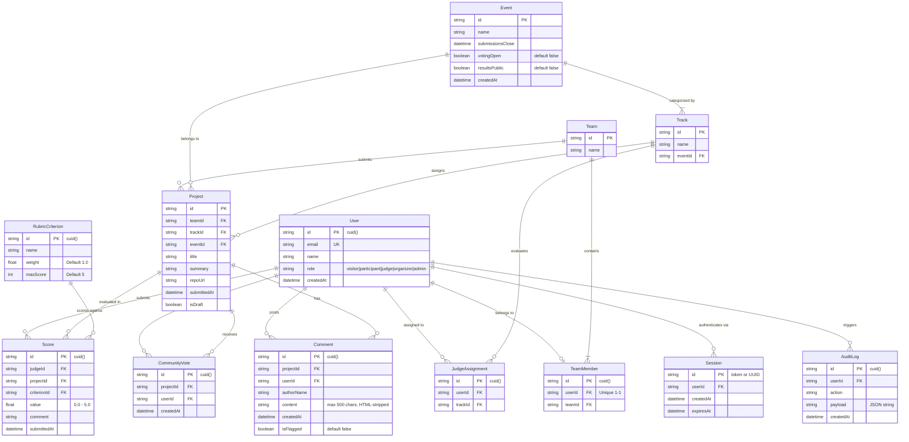

# DOGFOOD 2026 Data Model & Entity Specifications

> **Complete reference documentation for the 13 Prisma database models, entity-relationship constraints, fixture mapping rules, and transactional audit architecture.**

---

## 1. Entity-Relationship Diagram (Mermaid ERD)



---

## 2. Comprehensive Model Catalog (All 13 Prisma Entities)

### 2.1 `User`
Represents an authenticated actor or pre-seeded persona within the hackathon portal.
- **Fields:**
  - `id`: `String` (Primary Key, `@default(cuid())`).
  - `email`: `String` (Unique constraint `@unique`).
  - `name`: `String` (Display name).
  - `role`: `String` (`"visitor"` | `"participant"` | `"judge"` | `"organizer"` | `"admin"`).
  - `createdAt`: `DateTime` (`@default(now())`).
- **Relations:**
  - `sessions`: `Session[]` (One-to-many).
  - `teamMember`: `TeamMember?` (One-to-one optional).
  - `judgeAssignments`: `JudgeAssignment[]` (One-to-many).
  - `scores`: `Score[]` (One-to-many).
  - `auditLogs`: `AuditLog[]` (One-to-many).

### 2.2 `Session`
Stores active login sessions and deterministic tokens matching `.dogfood.toml`.
- **Fields:**
  - `id`: `String` (Primary Key, holds token string, e.g. `"org_seed_token_2026"`).
  - `userId`: `String` (Foreign key to `User.id`).
  - `createdAt`: `DateTime` (`@default(now())`).
  - `expiresAt`: `DateTime` (Expiration timestamp; expired sessions reject with `401`).
- **Relations:**
  - `user`: `User` (Belongs to User).

### 2.3 `Event`
Defines the hackathon lifecycle, track scopes, and submission cutoffs.
- **Fields:**
  - `id`: `String` (Primary Key, e.g. `"evt_dogfood_2026"`).
  - `name`: `String` (Event title).
  - `submissionsClose`: `DateTime` (Enforces hard deadline in `POST /api/projects`).
  - `createdAt`: `DateTime` (`@default(now())`).
- **Relations:**
  - `tracks`: `Track[]` (One-to-many).
  - `projects`: `Project[]` (One-to-many).

### 2.4 `Track`
Domain track under an event (e.g. Developer Tools, AI Agents, Infrastructure).
- **Fields:**
  - `id`: `String` (Primary Key, e.g. `"trk_dev_tools"`).
  - `name`: `String` (Track title).
  - `eventId`: `String` (Foreign key to `Event.id`).
- **Relations:**
  - `event`: `Event` (Belongs to Event).
  - `projects`: `Project[]` (One-to-many).
  - `judgeAssignments`: `JudgeAssignment[]` (One-to-many).

### 2.5 `Team`
Groups participants submitting a project.
- **Fields:**
  - `id`: `String` (Primary Key, e.g. `"team_alpha"`).
  - `name`: `String` (Team name).
- **Relations:**
  - `members`: `TeamMember[]` (One-to-many).
  - `projects`: `Project[]` (One-to-many).

### 2.6 `TeamMember`
Join entity binding a `User` to a `Team`.
- **Fields:**
  - `id`: `String` (Primary Key, `@default(cuid())`).
  - `userId`: `String` (Foreign key to `User.id`, `@unique` constraint enforces 1 team per user).
  - `teamId`: `String` (Foreign key to `Team.id`).
- **Relations:**
  - `user`: `User` (Belongs to User).
  - `team`: `Team` (Belongs to Team).

### 2.7 `Project`
The core submission entity rendered in the public gallery and evaluated by judges.
- **Fields:**
  - `id`: `String` (Primary Key, e.g. `"proj_01"`).
  - `teamId`: `String` (Foreign key to `Team.id`).
  - `trackId`: `String` (Foreign key to `Track.id`).
  - `eventId`: `String` (Foreign key to `Event.id`).
  - `title`: `String` (Project title, checked by acceptance test for `"Glass Signal"`, etc.).
  - `summary`: `String` (Short pitch or description).
  - `repoUrl`: `String` (Git repository link).
  - `submittedAt`: `DateTime` (Timestamp of project submission).
  - `isDraft`: `Boolean` (`@default(false)`).
- **Relations:**
  - `team`: `Team` (Belongs to Team).
  - `track`: `Track` (Belongs to Track).
  - `event`: `Event` (Belongs to Event).
  - `scores`: `Score[]` (One-to-many).

### 2.8 `RubricCriterion`
Weighted scoring criteria created by organizers.
- **Fields:**
  - `id`: `String` (Primary Key, `@default(cuid())`).
  - `name`: `String` (Criterion name, e.g. `"functionality"`, `"quality"`).
  - `weight`: `Float` (`@default(1.0)`).
  - `maxScore`: `Int` (`@default(5)`).
- **Relations:**
  - `scores`: `Score[]` (One-to-many).

### 2.9 `JudgeAssignment`
Explicit assignment of a judge to evaluate projects in a specific `Track`.
- **Fields:**
  - `id`: `String` (Primary Key, `@default(cuid())`).
  - `userId`: `String` (Foreign key to `User.id`).
  - `trackId`: `String` (Foreign key to `Track.id`).
- **Relations:**
  - `user`: `User` (Belongs to User).
  - `track`: `Track` (Belongs to Track).

### 2.10 `Score`
An individual numerical evaluation given by a judge on a specific project criterion.
- **Fields:**
  - `id`: `String` (Primary Key, `@default(cuid())`).
  - `judgeId`: `String` (Foreign key to `User.id`).
  - `projectId`: `String` (Foreign key to `Project.id`).
  - `criterionId`: `String` (Foreign key to `RubricCriterion.id`).
  - `value`: `Float` (Numerical score between 0.0 and 5.0).
  - `comment`: `String` (`@default("")`).
  - `submittedAt`: `DateTime` (`@default(now())`).
- **Relations:**
  - `judge`: `User` (Belongs to User).
  - `project`: `Project` (Belongs to Project).
  - `criterion`: `RubricCriterion` (Belongs to RubricCriterion).

### 2.11 `AuditLog`
Append-only tamper-evident security audit ledger.
- **Fields:**
  - `id`: `String` (Primary Key, `@default(cuid())`).
  - `userId`: `String` (Foreign key to `User.id`).
  - `action`: `String` (e.g. `"SUBMIT_SCORE"`, `"LOGIN"`).
  - `payload`: `String` (`@default("{}")`, JSON serialized metadata).
  - `createdAt`: `DateTime` (`@default(now())`).
- **Relations:**
  - `user`: `User` (Belongs to User).

---

## 2.12 `CommunityVote` *(Phase 6 — T3)*
Records a single community upvote from an authenticated user on a specific project.
- **Fields:**
  - `id`: `String` (Primary Key, `@default(cuid())`).
  - `projectId`: `String` (FK → `Project.id`).
  - `userId`: `String` (FK → `User.id`).
  - `createdAt`: `DateTime` (`@default(now())`).
- **Constraints:**
  - `@@unique([projectId, userId])` — **Database-level duplicate prevention.** A user can cast at most one upvote per project. Attempting a second insert is caught at the Prisma layer before a 409 is returned.
- **Anti-abuse invariants enforced at API layer (`POST /api/community/vote`):**
  - Self-vote check against `TeamMember`: if the voter's `teamId === project.teamId`, the request is rejected with `403 Forbidden`.
  - Toggling: if a `CommunityVote` already exists for `(projectId, userId)`, it is deleted (unvote); otherwise it is created (vote).
  - Each change appends `COMMUNITY_VOTE_CAST` or `COMMUNITY_VOTE_RETRACTED` to `AuditLog`.

### 2.13 `Comment` *(Phase 6 — T3)*
A community-authored text comment on a project submission.
- **Fields:**
  - `id`: `String` (Primary Key, `@default(cuid())`).
  - `projectId`: `String` (FK → `Project.id`).
  - `userId`: `String` (FK → `User.id`).
  - `authorName`: `String` (Display name at time of posting).
  - `content`: `String` (Sanitized plain text, max 500 chars, HTML stripped server-side).
  - `createdAt`: `DateTime` (`@default(now())`).
  - `isFlagged`: `Boolean` (`@default(false)`) — reserved for organizer moderation.
- **API safeguards (`POST /api/community/comments`):**
  - All HTML tags are stripped via regex before storage (XSS prevention).
  - Length is clamped to 500 characters.
  - In-memory rate limiting (one request per 10 seconds per userId) prevents rapid-fire spam.
  - Each successful post appends `COMMENT_POSTED` to `AuditLog`.

### 2.14 `Event` — Voting Lifecycle Fields *(Phase 6 — T3)*
Two fields were added to the existing `Event` model to power community voting state:
- `votingOpen`: `Boolean` (`@default(false)`) — controlled by organizer via `PATCH /api/community/settings`.
- `resultsPublic`: `Boolean` (`@default(false)`) — when `false`, `GET /api/community/vote` returns `totalVotes: null` for all non-organizer roles, eliminating bandwagon bias and social cascading during the voting window.

---

## 3. Fixture Ingestion & Mapping (`fixtures.json`)

The seed pipeline (`src/lib/seed.ts`) parses `Hack_docs/fixtures.json` and loads it into the database with idempotent upsert operations:

| JSON Key in `fixtures.json` | Target Prisma Model | Field Transformations & Ingestion Logic |
| :--- | :--- | :--- |
| `event` | `Event` | `id` $\rightarrow$ `id`<br>`name` $\rightarrow$ `name`<br>`submissions_close` $\rightarrow$ `submissionsClose` (`new Date(...)`) |
| `tracks[]` | `Track` | `id` $\rightarrow$ `id`<br>`name` $\rightarrow$ `name`<br>`eventId` bound to `event.id` |
| `teams[]` | `Team` | `id` $\rightarrow$ `id`<br>`name` $\rightarrow$ `name` |
| `projects[]` | `Project` | `id` $\rightarrow$ `id`<br>`title` $\rightarrow$ `title` (e.g. "Glass Signal")<br>`summary` $\rightarrow$ `summary`<br>`repo_url` $\rightarrow$ `repoUrl`<br>`track_id` $\rightarrow$ `trackId`<br>`team_id` $\rightarrow$ `teamId`<br>`submitted_at` $\rightarrow$ `submittedAt` |
| `judges[]` | `User` + `JudgeAssignment` | Created as `role: "judge"`. Each entry in `assigned_tracks[]` generates a `JudgeAssignment` record. |
| Hardcoded Test Suite | `User` + `Session` | Injects deterministic tokens for `organizer`, `judge_a`, `judge_b`, and `participant` with 30-day forward expiry. |

---

## 4. Transactional Score Submission & Audit Architecture

When a judge scores a project via `POST /api/judge/scores`:
```typescript
await prisma.$transaction(async (tx) => {
  // 1. Verify judge jurisdiction on project's track
  const assignment = await tx.judgeAssignment.findFirst({
    where: { userId: session.id, trackId: project.trackId },
  });
  if (!assignment) throw new Error('Not assigned to track');

  // 2. Conflict of interest defense: ensure judge is not a member of submitting team
  const isTeamMember = await tx.teamMember.findFirst({
    where: { userId: session.id, teamId: project.teamId },
  });
  if (isTeamMember) throw new Error('Conflict of interest');

  // 3. Atomic upsert of all rubric criteria
  for (const s of scores) {
    await tx.score.upsert({
      where: { /* judgeId_projectId_criterionId */ },
      create: { judgeId: session.id, projectId, criterionId: s.criterionId, value: s.value },
      update: { value: s.value, submittedAt: new Date() }
    });
  }

  // 4. Record immutable audit record
  await tx.auditLog.create({
    data: {
      userId: session.id,
      action: 'score_submitted',
      payload: JSON.stringify({ projectId, scores, comment }),
    }
  });
});
```
This guarantees ACID atomicity: an evaluation either fully persists with its accompanying audit trail, or fails completely without corrupting aggregate statistics.

---

## 5. Data Export Paths & Schema Transformations

DOGFOOD 2026 provides structured export pathways translating relational models into standardized deliverables:

### 5.1 RFC 4180 CSV Export Pipeline (`GET /api/export.csv`)
Restricted strictly to the `organizer` role. It joins `Project`, `Track`, `Score`, and `RubricCriterion`, transforms them through the normalization engine, and serializes to CSV:

```
[ Relational Database (Prisma) ]
  ├─ Project (id, title)
  ├─ Track (name)
  ├─ RubricCriterion (id, weight)
  └─ Score (judgeId, projectId, criterionId, value)
                 │
                 ▼
[ Transformation & Normalization Pipeline ]
  1. Rubric Weighting:  Composite_Raw = Σ (Value_c × Weight_c) / Σ Weight_c
  2. MAD Normalization: Modified_Z = 0.6745 × (Composite_Raw - Median) / MAD
  3. Cross-Judge Mean:  Project_Avg_Raw = Mean(Composite_Raw)
                        Project_Avg_Norm = Mean(Modified_Z)
  4. Ranking Sort:      Status Invariant (reviewed outranks unreviewed),
                        then NormalizedScore DESC (ε = 1e-9 tolerance),
                        then RawScore DESC, then ID ASC
                 │
                 ▼
[ RFC 4180 & CWE-1236 CSV Output Stream ]
  MIME: text/csv; charset=utf-8
  Content-Disposition: attachment; filename="omnijudge_scores.csv"
```

#### CSV Column Mapping Schema
| CSV Column Name | Source Prisma Model / Field | Transformation / Serialization Rule |
| :--- | :--- | :--- |
| `project_id` | `Project.id` | RFC 4180 quoted string escape with CWE-1236 sanitization |
| `project_title` | `Project.title` | RFC 4180 quoted string escape with CWE-1236 sanitization |
| `track` | `Track.name` (via `Project.trackId`) | Defaults to `'General'` if unassigned; quoted with CWE-1236 sanitization |
| `raw_score` | Derived from `Score.value` | Weighted arithmetic mean, fixed to 2 decimals (`.toFixed(2)`) |
| `normalized_score` | Derived via `normaliseAllJudges()` | Cross-judge average Modified Z-score, fixed to 4 decimals (`.toFixed(4)`) |
| `rank` | Computed ordinal rank | 1-based sequential integer ($1, 2, 3, ...$) |

### 5.2 JSON Real-Time Analytics Export (`GET /dashboard`)
Used by organizer Server Components to stream live data:
- **Judge Completion Rates:** Aggregates `Score.count` grouped by `judgeId` against `Project.count` for assigned tracks.
- **Audit Stream:** Chronological feed of `AuditLog` rows sorted by `createdAt DESC`.
- **Live Leaderboard:** Real-time normalized ranking updating with each submitted evaluation.

