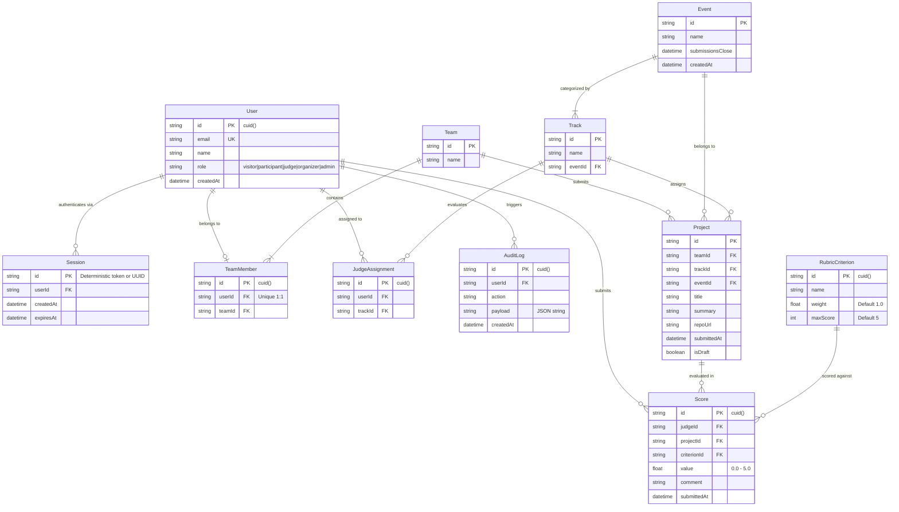

# DOGFOOD 2026 Data Model & Entity Specifications

> **Complete reference documentation for the 11 Prisma database models, entity-relationship constraints, fixture mapping rules, and transactional audit architecture.**

---

## 1. Entity-Relationship Diagram (Mermaid ERD)



---

## 2. Comprehensive Model Catalog (All 11 Prisma Entities)

### 2.1 `User`
Represents an authenticated actor or pre-seeded persona within the hackathon portal.
- **Fields:**
  - `id`: `String` (Primary Key, `@default(cuid())`).
  - `email`: `String` (Unique constraint `@unique`).
  - `name`: `String` (Display name).
  - `role`: `String` (`"visitor"` | `"participant"` | `"judge"` | `"organizer"` | `"admin"`).
  - `createdAt`: `DateTime` (`@default(now())`).
- **Relations:**
  - `sessions`: `Session[]` (One-to-many).
  - `teamMember`: `TeamMember?` (One-to-one optional).
  - `judgeAssignments`: `JudgeAssignment[]` (One-to-many).
  - `scores`: `Score[]` (One-to-many).
  - `auditLogs`: `AuditLog[]` (One-to-many).

### 2.2 `Session`
Stores active login sessions and deterministic tokens matching `.dogfood.toml`.
- **Fields:**
  - `id`: `String` (Primary Key, holds token string, e.g. `"org_seed_token_2026"`).
  - `userId`: `String` (Foreign key to `User.id`).
  - `createdAt`: `DateTime` (`@default(now())`).
  - `expiresAt`: `DateTime` (Expiration timestamp; expired sessions reject with `401`).
- **Relations:**
  - `user`: `User` (Belongs to User).

### 2.3 `Event`
Defines the hackathon lifecycle, track scopes, and submission cutoffs.
- **Fields:**
  - `id`: `String` (Primary Key, e.g. `"evt_dogfood_2026"`).
  - `name`: `String` (Event title).
  - `submissionsClose`: `DateTime` (Enforces hard deadline in `POST /api/projects`).
  - `createdAt`: `DateTime` (`@default(now())`).
- **Relations:**
  - `tracks`: `Track[]` (One-to-many).
  - `projects`: `Project[]` (One-to-many).

### 2.4 `Track`
Domain track under an event (e.g. Developer Tools, AI Agents, Infrastructure).
- **Fields:**
  - `id`: `String` (Primary Key, e.g. `"trk_dev_tools"`).
  - `name`: `String` (Track title).
  - `eventId`: `String` (Foreign key to `Event.id`).
- **Relations:**
  - `event`: `Event` (Belongs to Event).
  - `projects`: `Project[]` (One-to-many).
  - `judgeAssignments`: `JudgeAssignment[]` (One-to-many).

### 2.5 `Team`
Groups participants submitting a project.
- **Fields:**
  - `id`: `String` (Primary Key, e.g. `"team_alpha"`).
  - `name`: `String` (Team name).
- **Relations:**
  - `members`: `TeamMember[]` (One-to-many).
  - `projects`: `Project[]` (One-to-many).

### 2.6 `TeamMember`
Join entity binding a `User` to a `Team`.
- **Fields:**
  - `id`: `String` (Primary Key, `@default(cuid())`).
  - `userId`: `String` (Foreign key to `User.id`, `@unique` constraint enforces 1 team per user).
  - `teamId`: `String` (Foreign key to `Team.id`).
- **Relations:**
  - `user`: `User` (Belongs to User).
  - `team`: `Team` (Belongs to Team).

### 2.7 `Project`
The core submission entity rendered in the public gallery and evaluated by judges.
- **Fields:**
  - `id`: `String` (Primary Key, e.g. `"proj_01"`).
  - `teamId`: `String` (Foreign key to `Team.id`).
  - `trackId`: `String` (Foreign key to `Track.id`).
  - `eventId`: `String` (Foreign key to `Event.id`).
  - `title`: `String` (Project title, checked by acceptance test for `"Glass Signal"`, etc.).
  - `summary`: `String` (Short pitch or description).
  - `repoUrl`: `String` (Git repository link).
  - `submittedAt`: `DateTime` (Timestamp of project submission).
  - `isDraft`: `Boolean` (`@default(false)`).
- **Relations:**
  - `team`: `Team` (Belongs to Team).
  - `track`: `Track` (Belongs to Track).
  - `event`: `Event` (Belongs to Event).
  - `scores`: `Score[]` (One-to-many).

### 2.8 `RubricCriterion`
Weighted scoring criteria created by organizers.
- **Fields:**
  - `id`: `String` (Primary Key, `@default(cuid())`).
  - `name`: `String` (Criterion name, e.g. `"functionality"`, `"quality"`).
  - `weight`: `Float` (`@default(1.0)`).
  - `maxScore`: `Int` (`@default(5)`).
- **Relations:**
  - `scores`: `Score[]` (One-to-many).

### 2.9 `JudgeAssignment`
Explicit assignment of a judge to evaluate projects in a specific `Track`.
- **Fields:**
  - `id`: `String` (Primary Key, `@default(cuid())`).
  - `userId`: `String` (Foreign key to `User.id`).
  - `trackId`: `String` (Foreign key to `Track.id`).
- **Relations:**
  - `user`: `User` (Belongs to User).
  - `track`: `Track` (Belongs to Track).

### 2.10 `Score`
An individual numerical evaluation given by a judge on a specific project criterion.
- **Fields:**
  - `id`: `String` (Primary Key, `@default(cuid())`).
  - `judgeId`: `String` (Foreign key to `User.id`).
  - `projectId`: `String` (Foreign key to `Project.id`).
  - `criterionId`: `String` (Foreign key to `RubricCriterion.id`).
  - `value`: `Float` (Numerical score between 0.0 and 5.0).
  - `comment`: `String` (`@default("")`).
  - `submittedAt`: `DateTime` (`@default(now())`).
- **Relations:**
  - `judge`: `User` (Belongs to User).
  - `project`: `Project` (Belongs to Project).
  - `criterion`: `RubricCriterion` (Belongs to RubricCriterion).

### 2.11 `AuditLog`
Append-only tamper-evident security audit ledger.
- **Fields:**
  - `id`: `String` (Primary Key, `@default(cuid())`).
  - `userId`: `String` (Foreign key to `User.id`).
  - `action`: `String` (e.g. `"SUBMIT_SCORE"`, `"LOGIN"`).
  - `payload`: `String` (`@default("{}")`, JSON serialized metadata).
  - `createdAt`: `DateTime` (`@default(now())`).
- **Relations:**
  - `user`: `User` (Belongs to User).

---

## 3. Fixture Ingestion & Mapping (`fixtures.json`)

The seed pipeline (`src/lib/seed.ts`) parses `Hack_docs/fixtures.json` and loads it into the database with idempotent upsert operations:

| JSON Key in `fixtures.json` | Target Prisma Model | Field Transformations & Ingestion Logic |
| :--- | :--- | :--- |
| `event` | `Event` | `id` $\rightarrow$ `id`<br>`name` $\rightarrow$ `name`<br>`submissions_close` $\rightarrow$ `submissionsClose` (`new Date(...)`) |
| `tracks[]` | `Track` | `id` $\rightarrow$ `id`<br>`name` $\rightarrow$ `name`<br>`eventId` bound to `event.id` |
| `teams[]` | `Team` | `id` $\rightarrow$ `id`<br>`name` $\rightarrow$ `name` |
| `projects[]` | `Project` | `id` $\rightarrow$ `id`<br>`title` $\rightarrow$ `title` (e.g. "Glass Signal")<br>`summary` $\rightarrow$ `summary`<br>`repo_url` $\rightarrow$ `repoUrl`<br>`track_id` $\rightarrow$ `trackId`<br>`team_id` $\rightarrow$ `teamId`<br>`submitted_at` $\rightarrow$ `submittedAt` |
| `judges[]` | `User` + `JudgeAssignment` | Created as `role: "judge"`. Each entry in `assigned_tracks[]` generates a `JudgeAssignment` record. |
| Hardcoded Test Suite | `User` + `Session` | Injects deterministic tokens for `organizer`, `judge_a`, `judge_b`, and `participant` with 30-day forward expiry. |

---

## 4. Transactional Score Submission & Audit Architecture

When a judge scores a project via `POST /api/judge/scores`:
```typescript
await prisma.$transaction(async (tx) => {
  // 1. Verify judge jurisdiction on project's track
  const assignment = await tx.judgeAssignment.findFirst({
    where: { userId: session.id, trackId: project.trackId },
  });
  if (!assignment) throw new Error('Not assigned to track');

  // 2. Atomic upsert of all rubric criteria
  for (const s of scores) {
    await tx.score.upsert({
      where: { /* judgeId_projectId_criterionId */ },
      create: { judgeId: session.id, projectId, criterionId: s.criterionId, value: s.value },
      update: { value: s.value, submittedAt: new Date() }
    });
  }

  // 3. Record immutable audit record
  await tx.auditLog.create({
    data: {
      userId: session.id,
      action: 'SUBMIT_SCORE',
      payload: JSON.stringify({ projectId, scores, comment }),
    }
  });
});
```
This guarantees ACID atomicity: an evaluation either fully persists with its accompanying audit trail, or fails completely without corrupting aggregate statistics.
